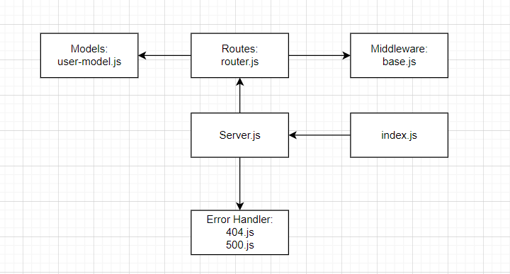

# Week 2
# Class06- Lab05
# Basic Auth
## Deployment Test
### Author: Boshra Jaber
* [tests report](https://github.com/BoshraJaber/basic-express-server/actions)
* [Heroku application for main branch]()
* [Pull Request to main]()

## Setup
- `.env` requirements:
 * PORT - 3000
 * MONGODB_URI=mongodb://localhost:27017/auth

- Install Required Packages:
  * `npm i express dotenv base-64 bcrypt mongoose`
  * `npm i -D @code-fellows/supergoose eslint jest`
  * `npm i -g nodemon`
- Running the app
 * `npm start` or `nodemon`
 1. Endpoint: `/signup`
   * Returns Object:
  ```
  {
   "username" : "Boshra"
   "password": "passworsd"
  }
  ```
 2. Endpoint: `/signin`
   * Returns Object:
  ```
  {
   "username" : "Boshra"
   "password": "passworsd"
    }
  ``` 
 3. Endpoint: `/error`
   * Returns Object:
  ```
  {
   "error": "Something went wrong!",
   "route": "/error",
   "message": "Error with the server"
   }
  ```
 4. Endpoint: `/random`
   * Returns Object:
  ```
  {
   "error": 404,
   "route": "/",
   "message": "Not Found"
   }
  ```
- In package.json file add:
  ```
  "scripts": {
    "start": "node index.js",
    "dev": "nodemon",
    "test": "jest --coverage --verbose ",
    "lint": "eslint '**/*.js'"
  }
  ```

## Tests
Unit Tests: `npm run test`
Lint Tests: `npm run lint`

## UML:
Here is a UML of my code: 
